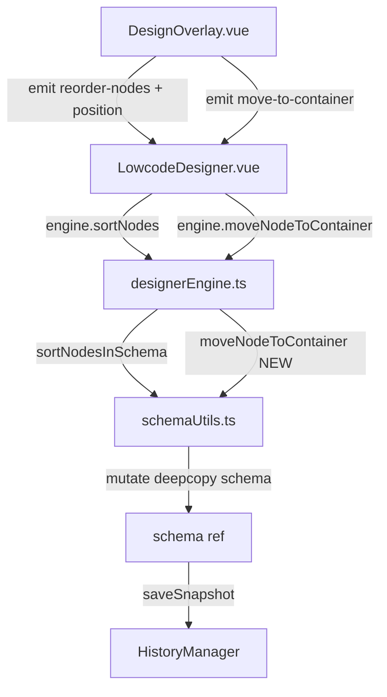

## 用户需求

为流式布局（flow mode）设计器画布新增拖拽排序与跨容器移动能力，分两个阶段实现。

## 产品概述

用户在设计器左侧物料面板拖入字段后，希望能在画布中直接通过拖拽来调整字段顺序，乃至将字段拖入/拖出 VoidField 容器（Card、Collapse 等）。交互上有一条实时的蓝色插入指示线跟随鼠标位置，清晰地告诉用户节点将插在目标的前面还是后面。

## 核心功能

**Phase 1 — 同层拖拽排序（完善现有框架）**

- 拖拽任意字段，悬停在同层其他字段上时，根据鼠标 Y 坐标上半/下半判断 `before` / `after`
- 实时渲染蓝色横线插入指示线（目前 `dropIndicator` 已声明但从未赋值，一直不显示）
- drop 时 emit `reorder-nodes`，携带正确的 `position: 'before' | 'after'`，engine 按此排序
- drag 期间被拖拽的节点半透明，目标节点有高亮框

**Phase 2 — 跨容器移动**

- 当 drop 目标是容器节点（VoidField/Card/Collapse 等，`isContainer === true`），且鼠标落在容器内部中心区域时，将源节点移入该容器末尾
- 拖入容器时，容器整体显示绿色高亮边框以区分"移入"与"排序"
- 从容器内部也可向外拖出（拖到容器外的平级节点上，按同层排序逻辑处理）
- `schemaUtils.ts` 新增 `moveNodeToContainer` 纯函数，保证操作原子性
- 支持撤销/重做（已有 HistoryManager）

## 技术栈

- Vue 3 Composition API + TypeScript（沿用现有项目栈）
- HTML5 DnD API（沿用 DesignOverlay 现有框架，无需引入第三方拖拽库）
- Element Plus（沿用现有组件库）

## 实现方案

### 核心策略

基于现有 `DesignOverlay.vue` 的 HTML5 DnD 框架做**精准的补丁式增强**，不重构现有架构。现有代码已有骨架（drag 事件绑定、dragOverNodeId 状态、dropIndicator ref），只需：

1. 补全 `handleDragOver` 中的鼠标位置计算和 `dropIndicator` 赋值逻辑
2. 修正 `handleDrop` emit 签名，传递 `position`
3. 在 `schemaUtils.ts` 新增跨容器操作的纯函数
4. 在 engine 中注册跨容器方法，在 `LowcodeDesigner.vue` 中绑定事件

### 关键技术决策

**before/after 判断**：在 `handleDragOver` 中通过 `e.clientY` 与目标 overlay item 的 `getBoundingClientRect()` 比较，若 `(clientY - rect.top) / rect.height < 0.5` 则 `before`，否则 `after`。

**dropIndicator 定位**：使用 overlay item 在 overlay 坐标系中的绝对坐标（已有 `item.style.left/top/width`），`before` 时指示线在 item.top，`after` 时在 item.top + item.height。

**跨容器判断**：容器节点上半/下半触发 `before/after` 排序，**中间 30% 区域**（0.35~0.65）触发 `move-into-container`（移入容器），以不同的高亮色（绿色边框）区分两种意图。

**`moveNodeToContainer` 实现**：深拷贝 schema → 在原 parent 中找到并删除节点 → 将节点插入目标容器的 `properties` 末尾（分配最大 `x-order + 10`）→ 替换 schema.value，saveSnapshot。

### 性能与可靠性

- `dropIndicator` 计算纯粹基于已有的 `overlayItems` 坐标，无额外 DOM 查询
- `moveNodeToContainer` 操作在深拷贝的 schema 上进行，失败时不会污染当前状态
- drag 状态（`dragNodeId`、`dropPosition`、`dropTarget`）均为 ref，不会引起额外的 overlay 刷新

## 架构设计



## 目录结构

```
D:\demo\ai\aiSpace\prototype\src\
├── designer\
│   ├── DesignOverlay.vue          # [MODIFY] 核心改动
│   │   - handleDragOver: 计算 before/after/into-container，给 dropIndicator.value 赋值
│   │   - handleDrop: emit 带 position 参数；容器中间区域 emit move-to-container
│   │   - emit 类型定义: 补充 position 第三参数；新增 move-to-container 事件
│   │   - 新增 dropPosition ref、dropTarget ref
│   │   - 新增 design-overlay__item--drag-into CSS class（绿色边框）
│   │
│   ├── LowcodeDesigner.vue        # [MODIFY] 事件绑定修正
│   │   - @reorder-nodes 改为三参数透传 position
│   │   - 新增 @move-to-container 绑定 → engine.moveNodeToContainer
│   │
│   └── engine\
│       ├── schemaUtils.ts         # [MODIFY] 新增纯函数
│       │   - moveNodeToContainer(schema, nodeId, containerId): boolean
│       │     逻辑：找到并暂存节点 → 从原 parent 删除 → 插入目标容器 properties 末尾
│       │
│       └── designerEngine.ts      # [MODIFY] 新增引擎方法
│           - moveNodeToContainer(nodeId, containerId): void
│             调用 schemaUtils.moveNodeToContainer，saveSnapshot，emit bus 事件
```

## 关键代码结构

```typescript
// schemaUtils.ts 新增函数签名
export function moveNodeToContainer(
  schema: SchemaWithProperties,
  nodeId: string,
  containerId: string
): boolean

// DesignOverlay.vue emit 类型（修改后）
const emit = defineEmits<{
  (e: 'select-node', id: string): void
  (e: 'remove-node', id: string): void
  (e: 'duplicate-node', id: string): void
  (e: 'move-node', id: string, direction: 'up' | 'down'): void
  (e: 'reorder-nodes', fromId: string, toId: string, position: 'before' | 'after'): void  // 新增 position
  (e: 'move-to-container', nodeId: string, containerId: string): void  // 新增
  (e: 'update-node-position', nodeId: string, updates: { x: number; y: number }): void
  (e: 'update-node-size', nodeId: string, updates: { width: number; height: number }): void
}>()
```

## 实现注意事项

1. **`dropIndicator` 宽度**：取目标 item 的 `width`，left 与 item 对齐，使指示线只覆盖该节点宽度（不跨满全行），视觉更精准
2. **拖拽离开清理**：`handleDragEnd` 中必须同时清空 `dropPosition`、`dropTarget`、`dropIndicator`，防止鬼影指示线残留
3. **容器自身不能拖入自身**：`moveNodeToContainer` 中需要检查 `nodeId !== containerId`
4. **VoidContainer 的 `data-field-id`**：确认渲染后容器节点有 `data-field-id` 属性，是 DesignOverlay 的 DOM 查找依据
5. **跨容器后 x-order 分配**：移入容器后取目标容器已有最大 `x-order + 10` 作为新 order
6. `sortNodesInSchema` 目前只处理同层节点（source 和 target 必须在同一 properties 下），跨层排序不应走这个路径，需在 DesignOverlay 的 drop handler 中明确区分

## Agent Extensions

### Skill

- **vue**
- Purpose: Vue 3 Composition API、script setup、defineEmits/defineProps 最佳实践指导
- Expected outcome: DesignOverlay.vue 的 emit 类型补充与 ref 状态管理符合 Vue 3 规范，避免响应式陷阱