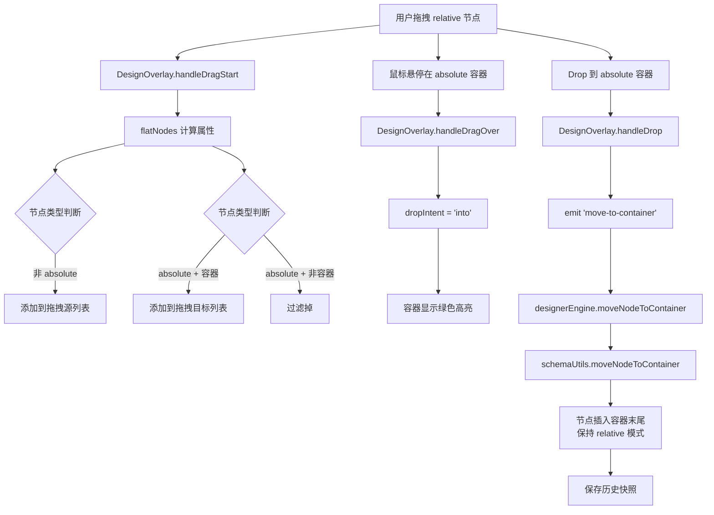

## 产品概述

实现流式布局节点与绝对定位容器之间的跨类型拖拽功能，使 relative 节点可以拖入 absolute 容器并保持相对定位模式。

## 核心功能

- **Hover 高亮反馈**：流式节点拖拽到 absolute 容器时，容器显示 hover 高亮效果
- **拖拽接纳**：流式节点 drop 到 absolute 容器后，按流式排列插入到容器 properties 末尾
- **定位保持**：拖入容器的节点保持 x-position-type: 'relative'，不转为 absolute 模式
- **兼容性保障**：不影响现有功能（relative 节点间拖拽排序、跨容器拖拽、absolute 节点的拖拽移动和缩放）

## 技术栈

- 前端框架：Vue 3 + TypeScript + Composition API
- UI 组件库：Element Plus
- 状态管理：Vue 3 reactive + computed
- 拖拽 API：HTML5 Drag and Drop API（流式节点）+ MouseEvent（absolute 节点）

## 实现方案

### 核心策略

采用 **双过滤策略**扩展 DesignOverlay 的 flatNodes 逻辑：

1. 保留原有的 relative 节点过滤（用于拖拽源和排序）
2. 新增 absolute 容器节点过滤（仅作为拖拽目标，用于 hover 高亮和 drop 接纳）

### 关键技术决策

1. **flatNodes 扩展**：将 absolute 类型的容器节点（type === 'void' 或 type === 'object'）添加到拖拽目标列表，标记为 isContainerTarget: true
2. **拖拽意图判断**：复用现有 dropIntent 逻辑（before/after/into），absolute 容器 + 鼠标落在中间 35%~65% 触发 into
3. **事件复用**：drop 到 absolute 容器时，继续使用 move-to-container 事件，engine 层无需修改（已支持跨类型节点移动）
4. **样式隔离**：absolute 容器作为拖拽目标时，使用单独的 CSS 类（design-overlay__item--target-container），避免与普通容器样式冲突

### 性能与可靠性

- **计算复杂度**：flatNodes 遍历整个 schema 树（O(n)），仅在 schema 变化或拖拽开始时触发一次，无性能问题
- **事件防抖**：drop 后通过 engine.saveSnapshot() 保存历史，支持撤销/重做
- **错误处理**：复用现有的 schemaUtils.moveNodeToContainer 方法，包含边界检查和错误提示

## 实现细节

### 核心目录结构

```
d:\ai\low-code-ai-coding\aiSpace\prototype\src\
├── designer/
│   ├── DesignOverlay.vue           # [MODIFY] 扩展 flatNodes 过滤逻辑，支持 absolute 容器作为拖拽目标
│   ├── LowcodeDesigner.vue        # [MODIFY] 确认跨类型拖拽事件处理正确
│   └── engine/
│       └── designerEngine.ts      # [CHECK] 验证 moveNodeToContainer 方法
```

### 关键代码结构

```typescript
// DesignOverlay.vue - FlatNode 接口扩展
interface FlatNode {
  id: string
  label: string
  isContainer: boolean
  parentId: string
  isContainerTarget?: boolean  // 新增：标记为拖拽目标容器（仅用于 hover/drop，不用于拖拽源）
}

// flatNodes 计算属性修改
const flatNodes = computed<FlatNode[]>(() => {
  const nodes: FlatNode[] = []
  function walk(properties: Record<string, FieldSchema>, parentId: string) {
    for (const [, schema] of Object.entries(properties)) {
      if (schema['x-id']) {
        const isAbsolute = schema['x-position-type'] === 'absolute'
        const isContainer = schema.type === 'void' || schema.type === 'object'
        
        // 场景1：relative 节点（普通拖拽源和目标）
        if (!isAbsolute) {
          nodes.push({
            id: schema['x-id'],
            label: schema.title ?? schema['x-component'] ?? '未知',
            isContainer,
            parentId,
          })
        }
        // 场景2：absolute 容器（仅作为拖拽目标，用于接纳 relative 节点）
        else if (isAbsolute && isContainer) {
          nodes.push({
            id: schema['x-id'],
            label: schema.title ?? schema['x-component'] ?? '未知',
            isContainer,
            parentId,
            isContainerTarget: true,  // 标记为容器目标
          })
        }
      }
      if ('properties' in schema && schema.properties) {
        walk(schema.properties as Record<string, FieldSchema>, schema['x-id'] ?? parentId)
      }
    }
  }
  if (props.schema?.schema?.properties) {
    walk(props.schema.schema.properties, '__root__')
  }
  return nodes
})

// handleDragOver 方法增强（保持现有逻辑，无需修改）
function handleDragOver(nodeId: string, e: DragEvent): void {
  if (isFreeLayout.value) return
  if (nodeId === dragNodeId.value) return
  e.preventDefault()
  if (e.dataTransfer) e.dataTransfer.dropEffect = 'move'

  dragOverNodeId.value = nodeId

  // ... 保持现有的拖拽意图判断逻辑（absolute 容器 isContainer=true，会触发 into）
}
```

### 样式调整

```css
/* DesignOverlay.vue - 新增容器目标样式 */
.design-overlay__item--target-container {
  border: 2px dashed #67c23a !important;
  background: rgba(103, 194, 58, 0.08) !important;
}

.design-overlay__item--target-container.design-overlay__item--drag-into {
  border: 2px solid #67c23a !important;
  background: rgba(103, 194, 58, 0.15) !important;
}
```

## 架构设计

### 系统架构图



### 数据流

```
拖拽开始：
  dragNodeId.value = sourceNodeId
  flatNodes.value = [relative 节点, absolute 容器节点...]

拖拽 hover：
  handleDragOver(targetNodeId)
    → 判断 dropIntent = 'into' (absolute 容器 + 鼠标在中间 35%-65%)
    → 更新 dragOverNodeId.value + dropIntent.value
    → CSS 类：.design-overlay__item--drag-into

拖拽 drop：
  handleDrop(targetNodeId)
    → emit('move-to-container', sourceNodeId, targetNodeId)
    → LowcodeDesigner.handleMoveToContainer
      → designerEngine.moveNodeToContainer
        → schemaUtils.moveNodeToContainer (原子操作)
          → 节点从原 parent 移除，插入目标 parent.properties 末尾
          → 保持 x-position-type: 'relative'（不修改）
```

## 目录结构

```
d:\ai\low-code-ai-coding\aiSpace\prototype\src\
├── designer/
│   ├── DesignOverlay.vue           # [MODIFY] 
│   │   ├── 扩展 FlatNode 接口，添加 isContainerTarget 标记
│   │   ├── 修改 flatNodes 计算属性，添加 absolute 容器节点过滤逻辑
│   │   ├── 添加 .design-overlay__item--target-container 样式
│   │   └── 验证 handleDragOver/handleDrop 方法正确处理容器目标
│   └── LowcodeDesigner.vue        # [CHECK] 
│   │   └── 确认 @move-to-container 事件监听器正确调用 engine 方法
└── designer/engine/
    └── designerEngine.ts          # [CHECK]
        └── 验证 moveNodeToContainer 方法支持跨类型节点移动
```

本次任务为纯逻辑功能增强，不涉及 UI 界面修改。复用现有的 DesignOverlay 拖拽交互样式，通过 CSS 类扩展实现 absolute 容器的 hover 高亮效果。

## 设计内容

### 视觉反馈增强

- **Hover 状态**：拖拽 relative 节点悬停在 absolute 容器时，容器显示绿色虚线边框（#67c23a），背景色浅绿（rgba(103, 194, 58, 0.08)）
- **Drop 目标确认**：鼠标在容器中间 35%~65% 区域时，边框变为实线绿色，背景色加深（rgba(103, 194, 58, 0.15)）
- **指示线保留**：before/after 位置仍显示蓝色指示线（复用现有 .design-overlay__drop-indicator）

### 交互流程

1. 用户拖拽 relative 节点开始（dragstart）
2. 鼠标移动到 absolute 容器区域（dragover）

- 触发容器高亮（CSS 类切换）
- 计算鼠标位置比例（ratio = (y - itemTop) / itemHeight）
- 判断 dropIntent（0.35 ≤ ratio ≤ 0.65 → into）

3. 释放鼠标（drop）

- 容器高亮消失
- 节点插入容器 properties 末尾
- 历史记录保存（支持撤销）

### 样式一致性

- 复用现有的容器 drop 高亮样式（.design-overlay__item--drag-into）
- 新增 .design-overlay__item--target-container 区分 absolute 容器作为拖拽目标
- 颜色系统保持一致性：
- 蓝色 (#409eff)：relative 节点和普通容器
- 绿色 (#67c23a)：容器 drop 目标（into 意图）
- 黄色 (#f59e0b)：排序目标（before/after 意图）

## Agent Extensions

### Skill

- **lowcode-designer**
- Purpose: 利用项目架构知识和 Schema 约定，确保修改符合现有代码规范和模式
- Expected outcome: 生成的代码遵循项目的编码风格、类型约定和架构决策
- **drag-drop-interaction**
- Purpose: 参考拖拽交互最佳实践，确保跨类型拖拽的实现逻辑正确
- Expected outcome: HTML5 Drag and Drop API 的使用符合标准，事件处理逻辑完整可靠
- **systematic-debugging**
- Purpose: 在修改后验证功能正确性，快速定位潜在问题
- Expected outcome: 通过系统性测试验证 hover 高亮、drop 接纳、定位保持等核心功能
- **verification-before-completion**
- Purpose: 在任务完成前运行验证命令，确保所有测试通过
- Expected outcome: 确认 154 个单元测试全部通过，TypeScript 零错误，功能符合预期