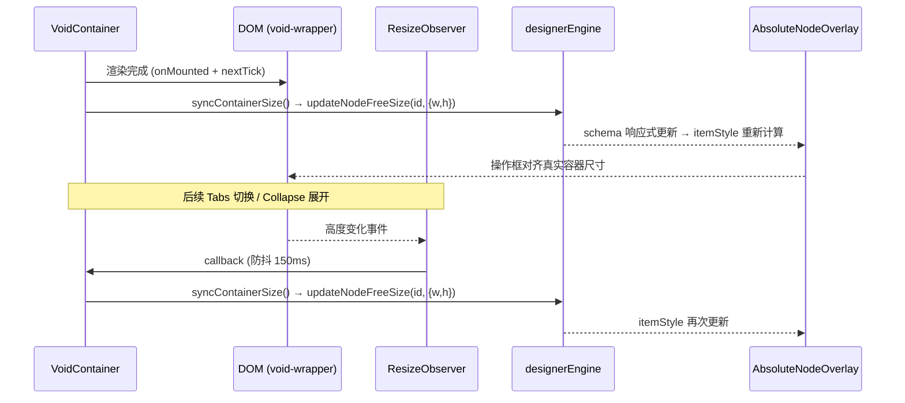

## 用户需求

等不及 deskclaw 的调研报告，由 Aiden 直接规划 VoidContainer 高度自适应方案，**仅出规划，不写代码**。

## 问题背景

VoidContainer 在 `x-position-type: 'absolute'` 模式下，高度硬编码为 schema 的 `x-position.height` 值。内容实际撑开后，DOM 高度正确，但 schema 未更新，导致 AbsoluteNodeOverlay 操作框错位。

同类问题在 FieldRenderer 已通过 `onMounted + nextTick` 检测实际尺寸 + `updateNodeFreeSize` 同步 schema 解决。但 VoidContainer 比 FieldRenderer 复杂：

- Card/Tabs/Collapse 内容是动态的（Tabs 切换标签页、Collapse 展开/收起，高度会变化）
- 初始渲染一次同步不够，需要响应后续的内容高度变化

## 核心功能点

1. **初始渲染高度同步**：VoidContainer absolute 模式下，onMounted 时检测真实高度，同步到 schema（复用 FieldRenderer 模式）
2. **动态内容高度跟踪**：Tabs 切换、Collapse 展开/收起后，自动重新同步高度（ResizeObserver + 防抖）
3. **内存安全**：onBeforeUnmount 时取消 ResizeObserver 监听，防止泄漏
4. **零干扰**：只在 designMode + absolute 模式下激活，不影响流式布局和预览模式

## 技术栈

Vue 3 + TypeScript，延续项目现有技术栈，零新依赖。

---

## 实现方案：混合模式（onMounted 首次同步 + ResizeObserver 防抖跟踪）

### 奥卡姆剃刀选型推导

| 方案 | 能否覆盖动态场景 | 性能 | 实现复杂度 | 结论 |
| --- | --- | --- | --- | --- |
| 仅 onMounted（宜搭模式） | 不能（Tabs/Collapse 变化无感知） | 最优 | 最低 | 不够用 |
| 纯 ResizeObserver（Retool 模式） | 能 | 有开销 | 中 | 过度 |
| 混合：onMounted + ResizeObserver 防抖（微搭模式） | 能 | 均衡 | 中 | **采用** |


混合模式的关键逻辑：`onMounted` 做初始同步（快速精准），`ResizeObserver` 负责后续动态变化检测（防抖 **200ms** 降低更新频率），`onBeforeUnmount` 断开观察。

> ⚠️ 防抖时长选 **200ms** 而非 150ms：el-collapse 展开动画约 300ms，el-tabs 切换亦有过渡，150ms 读取的是动画中间态，200ms 更稳定。

### 循环更新防护

`syncContainerSize()` 同步高度到 schema → Vue 响应式更新 → VoidContainer 重新渲染 → ResizeObserver 再次触发。

防护手段：**对比差异阈值**（>1px 才 dispatch）+ **防抖**（合并 150ms 内的连续触发）。正常情况下，schema 更新后真实 DOM 高度不变，ResizeObserver 不会再次触发，循环不会发生。

### 设计约束对齐

- 只在 `designMode && isAbsoluteMode` 条件下激活（复用 FieldRenderer 的守卫模式）
- VoidContainer 根 div（`.void-wrapper`）本身就是要观察的 DOM 元素，直接添加 `templateRef` 指向它
- ⚠️ **`wrapperStyle` 必须在 absolute 模式下剔除 `height`**：XLayout 的 `getNodeStyle()` 会透传 `height: Npx`，若直接注入 CSS 则 wrapper 高度被锁死，内容无法撑开，ResizeObserver 永远观察不到变化。方案：absolute 模式下从 nodeStyle 中解构排除 `height`，让 CSS 高度为 `auto`，由内容自然撑开；schema 的 `x-position.height` 作为"记录值"由 syncContainerSize 持续同步，不再作为 CSS 控制值。
- 同步调用 `designerEngine.updateNodeFreeSize(nodeId, { width, height })`，与 FieldRenderer 完全一致

---

## 实现细节

### 新增内容（仅 VoidContainer.vue）

**1. 新增 import**

```
ref, onMounted, onBeforeUnmount
```

**2. 新增 templateRef**

```typescript
const voidWrapperRef = ref<HTMLElement | null>(null)
```

模板中 `.void-wrapper` 添加 `ref="voidWrapperRef"`

**3. 新增 isAbsoluteMode 计算属性**（与 FieldRenderer 一致）

```typescript
const isAbsoluteMode = computed(() =>
  props.schema['x-position-type'] === 'absolute'
)
```

**4. wrapperStyle 改造**（新增，高级工程师补充）

```typescript
const wrapperStyle = computed((): CSSProperties => {
  if (isAbsoluteMode.value) {
    // absolute 模式：不注入 height，让内容自然撑开 wrapper
    // height 由 syncContainerSize 从 DOM 读取后回写 schema，不再作为 CSS 控制值
    const { height, ...rest } = props.nodeStyle as CSSProperties & { height?: unknown }
    return rest as CSSProperties
  }
  return { ...props.nodeStyle }
})
```

**5. 核心逻辑：syncContainerSize + ResizeObserver**

```typescript
// 同步尺寸到 schema
function syncContainerSize(): void {
  // 守卫1：非设计模式 或 非 absolute 模式时跳过（异步回调时条件可能已变）
  if (!designMode || !isAbsoluteMode.value) return
  if (!voidWrapperRef.value || !designerEngine) return
  const nodeId = props.schema['x-id']
  if (!nodeId) return
  const rect = voidWrapperRef.value.getBoundingClientRect()
  // 守卫2：容器不可见时（如 Tabs 非激活页，display:none），getBoundingClientRect 返回全零，跳过
  if (rect.width === 0 && rect.height === 0) return
  const currentWidth = props.schema['x-position']?.width ?? 200
  const currentHeight = props.schema['x-position']?.height ?? 40
  if (Math.abs(rect.width - currentWidth) > 1 || Math.abs(rect.height - currentHeight) > 1) {
    designerEngine.updateNodeFreeSize(nodeId, {
      width: Math.round(rect.width),
      height: Math.round(rect.height),
    })
  }
}

// 防抖 200ms（el-collapse 展开动画约 300ms，200ms 读取稳定高度）
let resizeTimer: ReturnType<typeof setTimeout> | null = null
let resizeObserver: ResizeObserver | null = null

onMounted(async () => {
  if (!designMode || !isAbsoluteMode.value) return
  await nextTick()
  syncContainerSize()                      // 首次精准同步
  // 注册 ResizeObserver 监听后续动态变化（Tabs 切换 / Collapse 展开）
  if (voidWrapperRef.value) {
    resizeObserver = new ResizeObserver(() => {
      if (resizeTimer) clearTimeout(resizeTimer)
      resizeTimer = setTimeout(syncContainerSize, 200)  // 防抖 200ms
    })
    resizeObserver.observe(voidWrapperRef.value)
  }
})

onBeforeUnmount(() => {
  resizeObserver?.disconnect()
  resizeObserver = null
  if (resizeTimer) clearTimeout(resizeTimer)
})
```

### 改动范围

**只动 `VoidContainer.vue` 一个文件**，改动量约 45 行，其余文件（XLayout、FieldRenderer、AbsoluteNodeOverlay、schema 类型定义）全部不动。

---

## 架构设计



---

## 目录结构

```
prototype/src/renderer/
└── VoidContainer.vue   # [MODIFY] 唯一改动文件
                        # 新增：ref="voidWrapperRef" 绑定到 .void-wrapper
                        # 新增：isAbsoluteMode computed
                        # 改造：wrapperStyle —— absolute 模式下剔除 height，让内容撑开
                        # 新增：syncContainerSize() 函数（含双守卫 + 零尺寸守卫）
                        # 新增：onMounted 首次同步 + ResizeObserver 注册（防抖 200ms）
                        # 新增：onBeforeUnmount 断开 ResizeObserver + 清理定时器
```

---

## 实施注意事项

- **守卫条件顺序**：`!designMode` 先判断，短路掉预览模式，避免性能浪费
- **BoundingClientRect vs offsetHeight**：使用 `getBoundingClientRect()` 与 FieldRenderer 保持一致，且精度更高
- **防抖时长 200ms**（已修正）：el-collapse 展开动画约 300ms，el-tabs 亦有过渡，200ms 确保读取稳定高度；原规划 150ms 有读到动画中间态的风险
- **零尺寸守卫**（新增）：Tabs 非激活页处于 `display: none`，getBoundingClientRect 返回全零，不加守卫会将 height 错误写成 0，操作框塌缩
- **syncContainerSize 内部双守卫**（新增）：ResizeObserver 是异步回调，onMounted 时的 designMode/isAbsoluteMode 条件在回调触发时可能已变（如用户切换定位类型），函数自身需能自洽
- **wrapperStyle 剔除 height**（新增，关键）：absolute 模式下 XLayout 透传的 `height: Npx` 会锁死 wrapper 高度，内容无法撑开，ResizeObserver 永远无法感知变化，整个方案失效。必须在 wrapperStyle computed 里 absolute 分支中解构排除 `height`
- **ResizeObserver 兼容性**：现代浏览器（Chrome 64+、Firefox 69+、Safari 13.1+）全部支持，无需 polyfill
- **不新增 sizeAutoFitted flag**：VoidContainer 需要持续跟踪（不同于 FieldRenderer 的一次性同步），故不使用 `sizeAutoFitted` 标志位
- **测试不受影响**：单元测试环境无 DOM，ResizeObserver 需 mock，但现有 154 个测试均不涉及 VoidContainer absolute 模式的 DOM 尺寸检测，不会新增失败