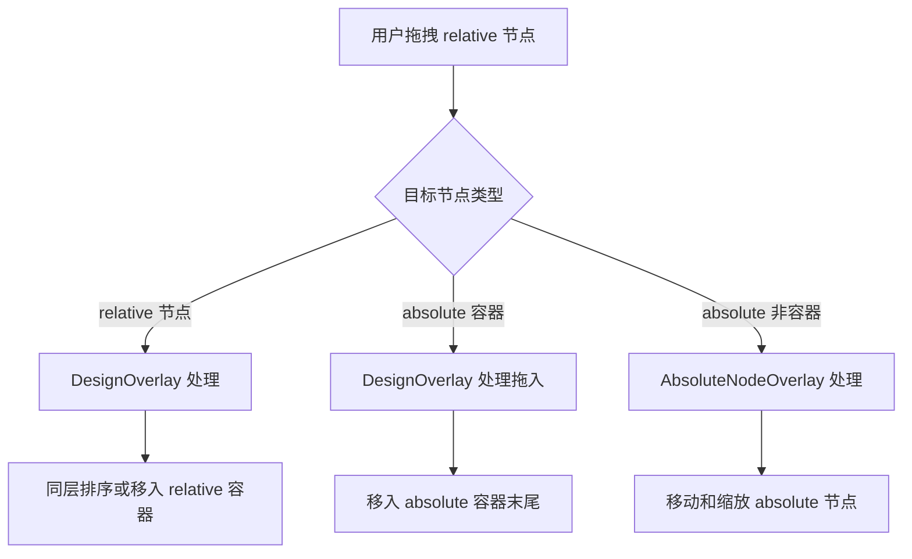
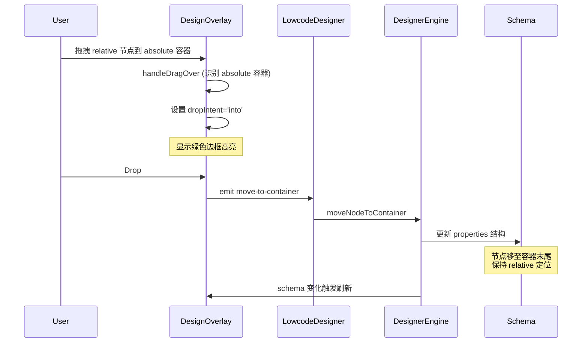

## 功能修复

### 核心需求

1. **画板 + 属性面板的可操作性和 BUG 修复**：确保设计器画板和属性面板的基础交互功能正常工作

2. **自由定位容器允许流式布局节点拖拽接纳**：

- 当流式布局节点（relative，即 `x-position-type` 不为 'absolute' 的节点）被拖拽到自由定位容器（absolute 容器，即 `x-position-type === 'absolute'` 且 `type === 'void'` 的容器）上方时：
    - 容器应显示 hover 高亮反馈（绿色边框）
    - Drop 后，流式节点应插入到容器 properties 的末尾
    - 节点保持 `x-position-type` 为 `'relative'`（不变），按容器内的流式布局规则排列

3. **拖拽行为**：

- 拖拽时：absolute 容器应该显示为有效的拖拽目标
- Drop 后：节点移动到容器内部，遵循容器的流式布局规则

4. **兼容性**：

- 不改变现有的同层节点拖拽排序逻辑
- 不改变现有的 relative 节点拖拽到 relative 容器的行为
- 不改变现有的 absolute 节点移动逻辑（由 AbsoluteNodeOverlay 处理）

## 用户体验

- 拖拽 relative 节点悬停在 absolute 容器上时，容器边框变绿（与现有的 `design-overlay__item--drag-into` 样式一致）
- Drop 后节点出现在容器内部，按自然流排列（不改变定位类型）

## 技术栈

- **前端框架**：Vue 3 + TypeScript + Composition API
- **UI 组件库**：Element Plus
- **拖拽方式**：HTML5 Drag and Drop API（DesignOverlay 处理流式节点拖拽）
- **Overlay 架构**：双 Overlay 系统（DesignOverlay + AbsoluteNodeOverlay）

## 技术方案

### 核心设计理念

1. **Overlay 职责分离**：

- `DesignOverlay.vue`：负责所有非 absolute 节点的交互（hover 高亮、拖拽排序、拖入容器）
- `AbsoluteNodeOverlay.vue`：负责 absolute 节点的拖拽移动和缩放
- 两个 overlay 协同工作，互不干扰

2. **拖拽接纳逻辑**：

- 流式节点（relative）拖拽时，无论目标容器是 relative 还是 absolute，都由 `DesignOverlay` 处理
- `DesignOverlay` 的 flatNodes 应该包含所有非 absolute 节点，但 **absolute 容器本身应该被视为可拖入目标**
- absolute 容器虽然自身是 absolute 定位，但作为容器时应该接纳 relative 子节点

### 实现策略

#### 策略 1：修改 flatNodes 过滤逻辑

**问题**：当前 `DesignOverlay.vue` 第 278 行过滤掉了所有 `x-position-type === 'absolute'` 的节点，导致 absolute 容器不在拖拽目标列表中。

**解决方案**：

- 修改 flatNodes 计算属性，**只过滤掉普通字段（非容器）的 absolute 节点**
- absolute 容器（`type === 'void'` 且 `x-position-type === 'absolute'`）应该保留在 flatNodes 中
- 这样 DesignOverlay 可以检测到这些容器并处理拖拽接纳

**伪代码**：

```typescript
const flatNodes = computed<FlatNode[]>(() => {
  const nodes: FlatNode[] = []

  function walk(properties: Record<string, FieldSchema>, parentId: string) {
    for (const [, schema] of Object.entries(properties)) {
      const isAbsolute = schema['x-position-type'] === 'absolute'
      const isContainer = schema.type === 'void'
      
      // 过滤规则：
      // 1. absolute + 非容器：过滤掉（由 AbsoluteNodeOverlay 处理）
      // 2. 其他（relative，或 absolute + 容器）：保留
      if (schema['x-id'] && !(isAbsolute && !isContainer)) {
        nodes.push({
          id: schema['x-id'],
          label: schema.title ?? schema['x-component'] ?? '未知',
          isContainer: isContainer,
          parentId,
        })
      }
      
      if ('properties' in schema && schema.properties) {
        walk(schema.properties as Record<string, FieldSchema>, schema['x-id'] ?? parentId)
      }
    }
  }

  if (props.schema?.schema?.properties) {
    walk(props.schema.schema.properties, '__root__')
  }
  return nodes
})
```

#### 策略 2：增强拖拽接纳判断

**问题**：当前 `DesignOverlay.vue` 的 `handleDragOver` 中，容器判断逻辑基于 `isTargetContainer`，但 absolute 容器应该被特殊处理。

**解决方案**：

- 在 `handleDragOver` 中，增加对 absolute 容器的识别
- absolute 容器作为拖拽目标时，也应该触发 `dropIntent === 'into'` 逻辑
- 现有的 `drag-into` 样式（绿色边框）可以直接复用

**伪代码**：

```typescript
function handleDragOver(nodeId: string, e: DragEvent): void {
  if (isFreeLayout.value) return
  if (nodeId === dragNodeId.value) return
  e.preventDefault()
  if (e.dataTransfer) e.dataTransfer.dropEffect = 'move'

  dragOverNodeId.value = nodeId

  const targetItem = overlayItems.value.find((i) => i.nodeId === nodeId)
  if (!targetItem) return

  const itemTop = parseFloat(targetItem.style.top as string) || 0
  const itemHeight = parseFloat(targetItem.style.height as string) || 0
  const relY = e.clientY - overlayRect.top
  const ratio = itemHeight > 0 ? (relY - itemTop) / itemHeight : 0.5

  const targetNode = flatNodes.value.find((n) => n.id === nodeId)
  const isTargetContainer = targetNode?.isContainer ?? false

  // 新增：判断是否为 absolute 容器
  const targetSchema = findNodeSchemaById(nodeId)
  const isAbsoluteContainer = targetSchema?.['x-position-type'] === 'absolute' && targetSchema.type === 'void'

  let intent: 'before' | 'after' | 'into'
  
  // 如果是容器（包括 absolute 容器），且鼠标落在中间区域，则移入容器
  if ((isTargetContainer || isAbsoluteContainer) && ratio >= 0.35 && ratio <= 0.65) {
    intent = 'into'
  } else {
    intent = ratio < 0.5 ? 'before' : 'after'
  }
  
  dropIntent.value = intent
  
  // 更新指示线（'into' 时不显示横线）
  if (intent === 'into') {
    dropIndicator.value = null
  } else {
    const indicatorTop = intent === 'before' ? itemTop - 1 : itemTop + itemHeight - 1
    dropIndicator.value = {
      style: {
        left: `${itemLeft}px`,
        top: `${indicatorTop}px`,
        width: `${itemWidth}px`,
      },
    }
  }
}
```

#### 策略 3：Drop 事件处理

**问题**：drop 到 absolute 容器时，现有的 `handleDrop` 逻辑应该保持不变，因为 `move-to-container` 事件已经存在。

**解决方案**：

- 无需修改 `handleDrop` 逻辑
- 当 `dropIntent === 'into'` 时，emit `move-to-container` 事件
- `designerEngine` 的 `moveNodeToContainer` 方法已经支持将节点移动到容器末尾
- 节点移动后，其 `x-position-type` 保持不变（relative）

### 验证策略

1. **单元测试**：

- 验证 flatNodes 计算属性包含 absolute 容器
- 验证拖拽接纳逻辑正确识别 absolute 容器

2. **集成测试**：

- 拖拽 relative 节点到 absolute 容器，验证：
    - 容器显示绿色边框高亮
    - Drop 后节点出现在容器内部
    - 节点保持 relative 定位，按流式排列

3. **边界条件**：

- 拖拽到 absolute 容器的边缘区域（非中间区域），验证仍能正确 drop 到容器
- 拖拽到非容器的 absolute 节点上，验证不会触发 drop 接纳

## 架构设计

### Overlay 协调图



### 数据流图



## 目录结构

```
d:/ai/low-code-ai-coding/aiSpace/prototype/src/designer/
├── DesignOverlay.vue          # [MODIFY] 修改 flatNodes 过滤逻辑和拖拽接纳判断
├── AbsoluteNodeOverlay.vue     # [UNCHANGED] 保持不变
└── LowcodeDesigner.vue         # [UNCHANGED] 保持不变（现有事件转发逻辑已足够）
```

## 关键代码结构

### FlatNode 接口定义

```typescript
interface FlatNode {
  id: string                    // 节点的 x-id
  label: string                 // 节点显示名称
  isContainer: boolean           // 是否为容器类型
  parentId: string              // 父节点的 x-id（根层为 '__root__'）
}
```

### findNodeSchemaById 函数

```typescript
function findNodeSchemaById(nodeId: string): FieldSchema | null {
  function walk(properties: Record<string, FieldSchema>): FieldSchema | null {
    for (const [, schema] of Object.entries(properties)) {
      if (schema['x-id'] === nodeId) return schema
      if ('properties' in schema && schema.properties) {
        const found = walk(schema.properties as Record<string, FieldSchema>)
        if (found) return found
      }
    }
    return null
  }
  return props.schema?.schema?.properties ? walk(props.schema.schema.properties) : null
}
```

该函数已在 `DesignOverlay.vue` 中实现（第 162-174 行），用于查找节点的 Schema 对象，以便判断是否为 absolute 容器。